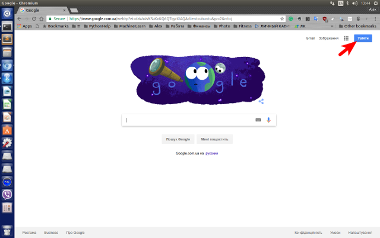
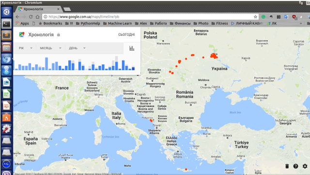
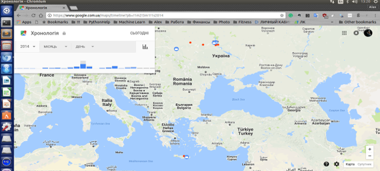
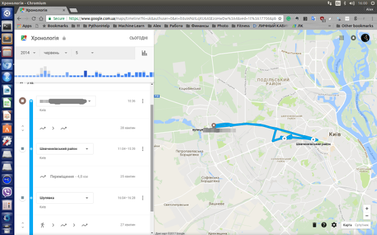

Title: Що всередині вашої Google location history? (Частина 1)
Slug: google_history1
Date: 2017-02-09 10:20
Category: R
Tags: google location, google history, vizualization, R
Status: published

Практично в усіх зараз є мобільний телефон, дехто має навіть декілька. Значна частина користувачів мобільного зв'язку має смартфон, та, скоріш за все, має і обліковий запис Google, в якому зберігаються контакти.  І якщо у вас на смартфоні дозволена передача даних про місцезнаходження, то Google зберігає у себе ваше розташування (принаймні, дуже хочу сподіватись, що це робиться тільки якщо ми дозволили). 

В цій частині допису буде показано, як подивитись, що там збережено. У продовженні ми спробуємо більш детально розібратися, які ж дані та в якому форматі зберігаються, а також яку інформацію з них можливо видобути.

Спочатку давайте зайдемо в свій Google-акаунт. 

Далі ми можемо отримати історію своїх переміщень за посиланням <https://www.google.com.ua/maps/timeline> :

Карта показує (червоні крапки) всі мої місезнаходження з моменту, коли я ввімкнув дозвіл на зберігання моєї історії місцезнаходжень по сьогоднішній день. Також є змога задати період, що показується в лівому верхньому куті. Там можна вказати рік, місяць та день. Наприклад на цьому скріншоті я вказав весь 2014 рік:

Якщо ми виберемо конкретний день, то побачимо більш детальний маршрут за цей день:

На данному етапі ми бачимо що Google запам'ятовує наші координати, за умови що така дія була йому дозволена. Якщо такого дозволу не було чи ми видалили історію місцезнаходження - ми побачимо просто "пусту" карту. 

В наступному дописі ми заглянемо глибше у дані щодо місцезнаходження і подивимось, яку ще інформацію можна звідти отримати.

<noscript>Please enable JavaScript to view the <a href="https://disqus.com/?ref_noscript">comments powered by Disqus.</a></noscript>
                                