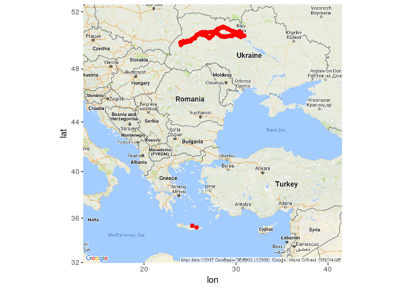
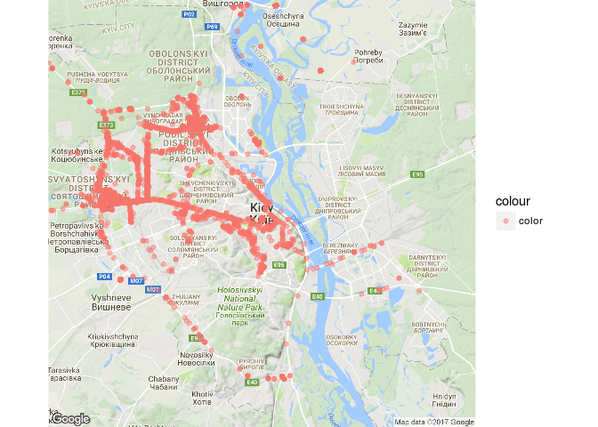
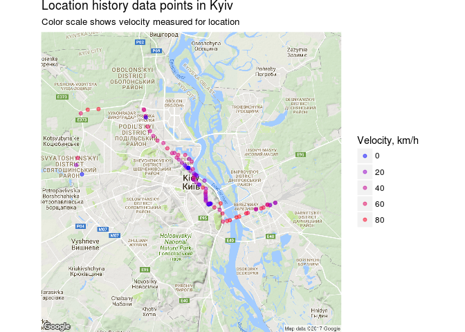
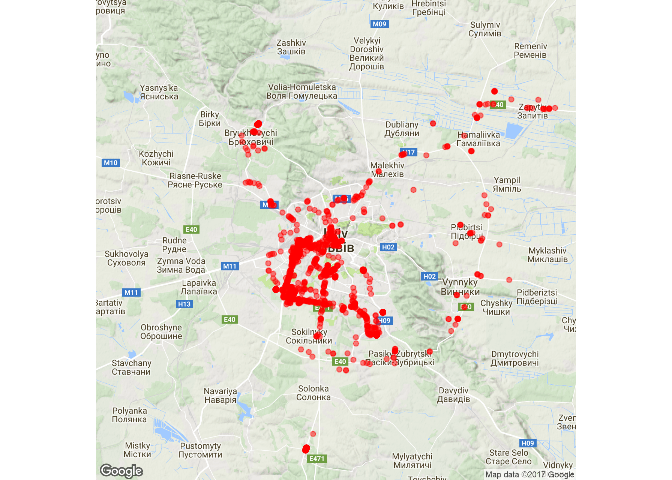
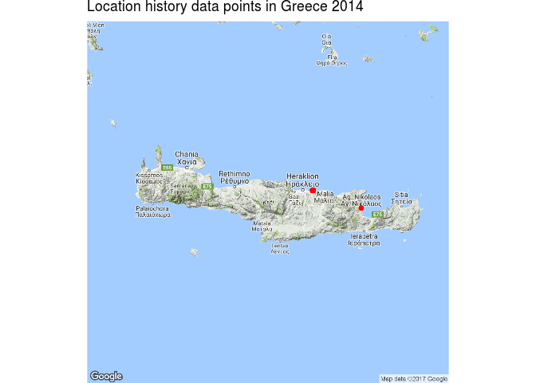
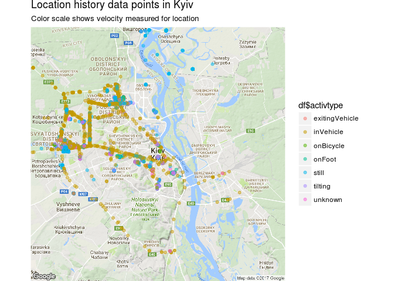

Title: Що всередині вашої Google location history? (Частина 2)
Slug: google_history2
Date: 2017-02-10 12:20
Category: R
Tags: google location, google history, vizualization, R
Status: published


У [попередній частині](/google_history1.html) ми подивилися на свою збережену хронологію місцезнаходжень, яку зберігає Google. Сьогодні подивитимся на те, які ж дані і в якому форматі там зберігаються, а також як їх можливо використати. Для цього ми  отримаємо історію своїх переміщень у вигляді окремого файла. Давайте зайдемо в свій Google-account за посиланням <https://takeout.google.com/settings/takeout> та оберемо тільки пункт "Карти (ваші місця)":


Google збереже дані у вигляді файла з розширенням **".json"**. Це один із форматів зберігання даних, на кшалт файлів csv чи xls. Його можна також конвертувати **json** в **csv** чи **xls** і далі працювати з даними, наприклад, у програмі Excel.

Я буду працювати з цими даними за допомогою мови програмування R, яка є чудовим інструментом для аналізу та візуалізації. Ви можете повторити ці розрахунки для себе, використовуючи наведений нижче код.

Отже почнемо.

Загальна статистика
-------------------

Спочатку прочитаємо дані. Це можна зробити за допомогою бібліотеки **jsonlite**

``` r
library(jsonlite)
require(plyr)
```

    ## Loading required package: plyr

``` r
system.time(x <- fromJSON("MyHistory2016.json"))

```

    ##    user  system elapsed 
    ## 157.980   0.800 159.924

Файл зчитано, це зайняло майже 5 хвилин у мене. Давайте подивимось, які дані ми маємо в архіві:

``` r
# extracting the locations dataframe
loc <- x$locations
head(loc)
```

    ##     timestampMs latitudeE7 longitudeE7 accuracy
    ## 1 1483202768847  504572835   303665397       22
    ## 2 1483202542843  504572835   303665397       24
    ## 3 1483202274259  504572835   303665397       24
    ## 4 1483202241847  504572835   303665397       24
    ## 5 1483202083232  504572835   303665397       24
    ## 6 1483201993082  504572835   303665397       27
    ##                                                activitys velocity altitude
    ## 1                              1483202767058, still, 100       NA       NA
    ## 2                                                   NULL       NA       NA
    ## 3                              1483202401830, still, 100       NA       NA
    ## 4                              1483202226817, still, 100       NA       NA
    ## 5 1483202084834, 1483202039768, still, 100, tilting, 100       NA       NA
    ## 6                              1483201994702, still, 100       NA       NA
    ##   heading
    ## 1      NA
    ## 2      NA
    ## 3      NA
    ## 4      NA
    ## 5      NA
    ## 6      NA

``` r
#get column names
names(loc)
```

    ## [1] "timestampMs" "latitudeE7"  "longitudeE7" "accuracy"    "activitys"  
    ## [6] "velocity"    "altitude"    "heading"

Це таблиця з 8 колонок:

-   timestampMs - дані щодо дати/часу у форматі POSIX, які ми потім конвертуємо у звичний формат;

-   latitudeE7, longitudeE7 - координати місцезнаходження у форматі Е7, які ми також зможемо перевести у GPS-координати;

-   accuracy - точність, містить помилку розташування біля точки у GPS-координатах (вимірюється у метрах);

-   activitys - дані щодо діяльності в вказаний момент часу (детальніше трохи згодом);

-   velocity, heading, altitude - швидкість (м/с), напрям, висота (метрів) над рівнем моря.


Далі конвертуємо дані часу, координат та додаємо до таблиці дані про точність:

``` r
ldf <- data.frame(t=rep(0,nrow(loc)))

# converting time column from posix milliseconds into a readable time scale
ldf$time <- as.POSIXct(as.numeric(x$locations$timestampMs)/1000, origin = "1970-01-01")
ldf$date <- as.Date(ldf$time, format = "%Y-%m-%d")

# converting longitude and latitude from E7 to GPS coordinates
ldf$lat <- loc$latitudeE7 / 1e7
ldf$lon <- loc$longitudeE7 / 1e7
ldf$accuracy <- loc$accuracy
ldf$t<-NULL
```

Ось так виглядають наші дані тепер:

``` r
head(ldf)
```

    ##                  time       date      lat      lon accuracy
    ## 1 2016-12-31 18:46:08 2016-12-31 50.45728 30.36654       22
    ## 2 2016-12-31 18:42:22 2016-12-31 50.45728 30.36654       24
    ## 3 2016-12-31 18:37:54 2016-12-31 50.45728 30.36654       24
    ## 4 2016-12-31 18:37:21 2016-12-31 50.45728 30.36654       24
    ## 5 2016-12-31 18:34:43 2016-12-31 50.45728 30.36654       24
    ## 6 2016-12-31 18:33:13 2016-12-31 50.45728 30.36654       27

Тепер колонки часу та координат набули звичного для нас вигляду. Саме час розібратися із змістом самої таблиці.

Переформуємо дані щодо переміщень (**activitys**)

``` r
# get the most likely activity type and confidence for each time point.
act <- laply(loc$activitys, function(f) {
  if(is.null(f[[1]])) data.frame(activity=NA,confidence=NA,stringsAsFactors=F) else data.frame(activity=f[[2]][[1]][[1]][1],confidence=f[[2]][[1]][[2]][1],stringsAsFactors=F)
},.progress="none")

# combine activity data with the main dataset
ldf$activity <- as.character(act[,1])
ldf$confidence <- as.numeric(act[,2])
```

**activitys** може бути наступних видів:

``` r
a<-count(ldf$activity)
a<-a[order(-a$freq),]
a
```

    ##                x    freq
    ## 3             NA 1068379
    ## 6          still  387711
    ## 7        tilting   26614
    ## 2      inVehicle   16570
    ## 8        unknown   16467
    ## 5         onFoot   10979
    ## 4      onBicycle     680
    ## 1 exitingVehicle     427

Надалі спробуємо отримати з цих ознак щось путнє.

Додаємо дані про швидкість, висоту та напрям руху

``` r

ldf$velocity <- loc$velocity*3.6  # m/s -> km/h
ldf$heading <- loc$heading
ldf$altitude <-loc$altitude
```

Все, більше інофрмації в Google location history немає, тому збережемо отриманий результат на диск та звільнимо оперативну память

``` r
#save ready data
# saveRDS(ldf, "./loc_data.rds")
# rm(list=ls())
```

##Які таємниці про користувача сховані у Google location history
----------------------

Для зручності та більш швидкої обробки давайте розіб'ємо дані по роках.

``` r
ldf<-readRDS("./loc_data.rds")
df2013<-subset(ldf,date >= as.Date("2013-01-01") & date <= as.Date("2013-12-31"))
df2014<-subset(ldf,date >= as.Date("2014-01-01") & date <= as.Date("2014-12-31"))
df2015<-subset(ldf,date >= as.Date("2015-01-01") & date <= as.Date("2015-12-31"))
df2016<-subset(ldf,date >= as.Date("2016-01-01") & date <= as.Date("2016-12-31"))
```

### З якого моменту Google слідкував за мною?

``` r
min(ldf$time)
```

    ## [1] "2012-12-22 16:54:39 EET"

**Отже з 22 грудня 2012 року :)**

### З якою частотою це відбувалось?

Подивимось загальну статистику даних:

-   кількість записів

``` r
nrow(ldf)
```

    ## [1] 1527827

-   час початку та кінцевий відслідковування (слід зауважити, що архів я отримав станом на вечір 31 грудня 2016 року, щоб мати повну статистику ще й за 2016 рік)

``` r
min(ldf$time)
```

    ## [1] "2012-12-22 16:54:39 EET"

``` r
max(ldf$time)
```

    ## [1] "2016-12-31 18:46:08 EET"

Всього архів містить 1 527 827 зафіксованих місцезнаходжень з 22-12-2012 до 31-12-2016.

``` r
points_p_day <- data.frame(table(ldf$date), group = "day")
summary(points_p_day)
```

    ##          Var1           Freq        group     
    ##  2012-12-22:   1   Min.   :   1.0   day:1118  
    ##  2012-12-23:   1   1st Qu.: 496.2             
    ##  2012-12-24:   1   Median : 765.5             
    ##  2012-12-25:   1   Mean   :1366.6             
    ##  2012-12-26:   1   3rd Qu.:1437.0             
    ##  2012-12-27:   1   Max.   :5928.0             
    ##  (Other)   :1112

**Це 1118 днів, протягом яких частота (Freq) фіксації місцезнаходження коливалась від 1 до 5928 раз на добу. В середньому це склало 1367 раз на добу, 56,91 раз на годину, або майже 1 раз на хвилину.**

_* Оскільки між цими двома датами мало би бути 1470 днів, то відповідно інформація про 352 днів була видалена або я забороняв збір даних щодо місцезнаходження. Нічого дивного, бо на той час я ще не сподівався, що буду вивчати своє місцезнаходження за декілька років._

Насправді, інтервал оновлення визначається рівнем заряду батареї, від того рухаєтесь Ви чи ні, як швидко рухаєтесь та деяких інших факторів.

### Де я побував, наприклад, в 2014 році?

``` r
require('ggplot2')
require('ggmap')
```

    ## Loading required package: ggplot2
    ## Loading required package: ggmap

``` r
df<-df2014

# compute the bounding box
ldf_bbox <- make_bbox(lat = df$lat, lon = df$lon,f=0.7)

ldf_big  <- get_map(location = ldf_bbox, source='google',maptype = "roadmap", zoom = 5)

ggmap(ldf_big ) + 
  geom_point(data = df, mapping =aes(x = lon, y = lat, color="color"), color = "red") 

```

    ## Warning: bounding box given to google - spatial extent only approximate.
    ## converting bounding box to center/zoom specification. (experimental)
    ## Map from URL : http://maps.googleapis.com/maps/api/staticmap?center=43.093942,27.436017&zoom=5&size=640x640&scale=2&maptype=roadmap&language=en-EN&sensor=false


 

**Червоні позначки на карті показують всі мої координати протягом року. Як видно, в 2014 році я подорожував по Україні та був на острові Крит у Греції.**

### Де я бував у Києві?

Давайте глянемо на мої місцезнаходження у більшому масштабі. Спершу Київ.

``` r
l<-geocode('Ukraine, Kyiv')

region<-get_googlemap(center = c(l$lon,l$lat), color = "color",size = c(640,640),scale = 2,zoom = 11)

ggmap(region, extent="device") + 
  geom_point(data = df, aes(x = lon, y = lat,color = "color"), alpha = 0.5)

```

    ## Information from URL : http://maps.googleapis.com/maps/api/geocode/json?address=Ukraine,%20Kyiv&sensor=false
    ## Map from URL : http://maps.googleapis.com/maps/api/staticmap?center=50.4501,30.5234&zoom=11&size=640x640&scale=2&maptype=terrain&sensor=false
    ## Warning: `panel.margin` is deprecated. Please use `panel.spacing` property
    ## instead
    ## Warning: Removed 23604 rows containing missing values (geom_point).

 

Добре видно, що більшість моїх місцеперебувань знаходилися на правому березі Дніпра, на лівому фактично лише окремі точки. Щоб отримати більш виразну картину, давайте змінимо колір точки перебування в залежності від швидкості, таким чином буде видно чи я просто проїзджав місцевість чи, можливо, знаходився там більш довгий час.

``` r
df<-df[which(!is.na(df$velocity)), ]

ggmap(region, extent="device") + 
  geom_point(data = df, aes(x = lon, y = lat, color=velocity), alpha = 0.5)+
  theme(legend.position = "right") + 
  labs(x = "Longitude", y = "Latitude", 
       title = "Location history data points in Kyiv",
       subtitle = "Color scale shows velocity measured for location"
       ) +
  scale_colour_gradient(low ="blue", high = "red", guide = guide_legend(title = "Velocity, km/h"))
```

    ## Warning: `panel.margin` is deprecated. Please use `panel.spacing` property
    ## instead

        

**Точки з синім кольором показують місця, де я на протязі року знаходився найдовше. Це дім, робота etc.**

### Де я бував у Львові?

``` r
df<-df2014
l<-geocode('Ukraine, Lviv')

region<-get_googlemap(center = c(l$lon,l$lat), color = "color",size = c(640,640),scale = 2,zoom = 11)

ggmap(region,extent="device") + geom_point(data = df, aes(x = lon, y = lat, color=velocity), alpha = 0.5, color = "red")

```

    ## Information from URL : http://maps.googleapis.com/maps/api/geocode/json?address=Ukraine,%20Lviv&sensor=false
    ## Map from URL : http://maps.googleapis.com/maps/api/staticmap?center=49.839683,24.029717&zoom=11&size=640x640&scale=2&maptype=terrain&sensor=false
    ## Warning: `panel.margin` is deprecated. Please use `panel.spacing` property
    ## instead
    ## Warning: Removed 194024 rows containing missing values (geom_point).



### Де я бував у Греції?

``` r
l<-geocode('Greece, Crete')

region<-get_googlemap(center = c(l$lon,l$lat), color = "color",size = c(640,640),scale = 2,zoom = 8)

ggmap(region,extent="device") + geom_point(data = df, aes(x = lon, y = lat), alpha = 0.5, color = "red")+
  theme(legend.position = "right") +
  labs(
    x = " ",
    y = " ",
    title = "Location history data points in Greece 2014")

```

    ## Information from URL : http://maps.googleapis.com/maps/api/geocode/json?address=Greece,%20Crete&sensor=false
    ## Map from URL : http://maps.googleapis.com/maps/api/staticmap?center=35.240117,24.809269&zoom=8&size=640x640&scale=2&maptype=terrain&sensor=false
    ## Warning: `panel.margin` is deprecated. Please use `panel.spacing` property
    ## instead
    ## Warning: Removed 202813 rows containing missing values (geom_point).



### Що показує параметр "activity" ?

Google визначає для кожної пари координат яким чином пересувався об'єкт і якщо активність позначити кольором (так само як я зробив для швидкості), то можливо побачити на карті найбільш частий для конкретної точки тип активністі.

``` r
df<-df2014
df$activity[df$activity=="NA"]= NA
df<-df[which(!is.na(df$activity)), ]

df$activtype<-as.factor(df$activity)
a<-count(df$activity)
a<-a[order(-a$freq),]
a
```

    ##                x   freq
    ## 5          still 123901
    ## 6        tilting   8014
    ## 2      inVehicle   4013
    ## 7        unknown   3760
    ## 4         onFoot    733
    ## 1 exitingVehicle     58
    ## 3      onBicycle     46

-   still - об'єкт знаходився на місці

-   tilting - об'єкт повертає

-   inVehicle - об'єкт рухається в транспорті

-   unknown - невідомий вид активності

-   onFoot - об'єкт йде пішки

-   onBicycle - об'єкт рухається на велосипеді

-   exitingVehicle - об'єкт залишає траспортний засіб

``` r
l<-geocode('Ukraine, Kyiv')

region<-get_googlemap(center = c(l$lon,l$lat), color = "color",size = c(640,640),scale = 2,zoom = 11)

colors <- colorRampPalette(c("blue", "yellow", "red"))(length(levels(df$activtype)))

colors

ggmap(region, extent="device") + 
  geom_point(data = df, aes(x = lon, y = lat, color=df$activtype), alpha = 0.5)+
  theme(legend.position = "right") + 
  labs(x = "Longitude", y = "Latitude", 
       title = "Location history data points in Kyiv",
       subtitle = "Color scale shows velocity measured for location"
       ) +
   scale_fill_manual(values=setNames(colors, levels(df$activtype)))

```

    ## Information from URL : http://maps.googleapis.com/maps/api/geocode/json?address=Ukraine,%20Kyiv&sensor=false
    ## Map from URL : http://maps.googleapis.com/maps/api/staticmap?center=50.4501,30.5234&zoom=11&size=640x640&scale=2&maptype=terrain&sensor=false
    ## [1] "#0000FF" "#5555AA" "#AAAA55" "#FFFF00" "#FFAA00" "#FF5500" "#FF0000"
    ## Warning: `panel.margin` is deprecated. Please use `panel.spacing` property
    ## instead
    ## Warning: Removed 13491 rows containing missing values (geom_point).



Наостанку зробимо частотний розподіл активності за 2014 рік.

``` r
ggplot(df, aes(x = df$activity, group = activity, fill = activtype)) + 
  geom_bar()  + 
  guides(fill = FALSE) +
   labs(
    x = "",
    y = "Count",
    title = "Main activities in 2014",
    caption = "Associated activity for recorded positions in 2014. 
    Because Google records activity probabilities for each position, 
    only the activity with highest likelihood were chosen for each position."
  )
```

 

**Як видно з діаграми, більшість часу я знаходився у якомусь місці, а коли рухався, то пересувався на авто.** 
До речі, на велосипеді я не пересувався зовсім, це скорше інформація з транспортних заторів, в які я попадав.

Наостанку інформація про сесію R-Studio.

``` r
sessionInfo()
```

    ## R version 3.2.3 (2015-12-10)
    ## Platform: x86_64-pc-linux-gnu (64-bit)
    ## Running under: Ubuntu 16.04.2 LTS
    ## 
    ## locale:
    ##  [1] LC_CTYPE=en_US.UTF-8       LC_NUMERIC=C              
    ##  [3] LC_TIME=uk_UA.UTF-8        LC_COLLATE=en_US.UTF-8    
    ##  [5] LC_MONETARY=uk_UA.UTF-8    LC_MESSAGES=en_US.UTF-8   
    ##  [7] LC_PAPER=uk_UA.UTF-8       LC_NAME=C                 
    ##  [9] LC_ADDRESS=C               LC_TELEPHONE=C            
    ## [11] LC_MEASUREMENT=uk_UA.UTF-8 LC_IDENTIFICATION=C       
    ## 
    ## attached base packages:
    ## [1] stats     graphics  grDevices utils     datasets  methods   base     
    ## 
    ## other attached packages:
    ## [1] ggmap_2.6.1    ggplot2_2.2.1  plyr_1.8.4     jsonlite_1.2  
    ## [5] markdown_0.7.7 knitr_1.15.1  
    ## 
    ## loaded via a namespace (and not attached):
    ##  [1] Rcpp_0.12.9       magrittr_1.5      maps_3.1.1       
    ##  [4] munsell_0.4.3     lattice_0.20-33   geosphere_1.5-5  
    ##  [7] colorspace_1.3-2  rjson_0.2.15      jpeg_0.1-8       
    ## [10] stringr_1.1.0     tools_3.2.3       grid_3.2.3       
    ## [13] gtable_0.2.0      png_0.1-7         htmltools_0.3.5  
    ## [16] yaml_2.1.14       lazyeval_0.2.0    rprojroot_1.2    
    ## [19] digest_0.6.12     assertthat_0.1    tibble_1.2       
    ## [22] reshape2_1.4.2    mapproj_1.2-4     evaluate_0.10    
    ## [25] rmarkdown_1.3     labeling_0.3      sp_1.2-4         
    ## [28] stringi_1.1.2     RgoogleMaps_1.4.1 scales_0.4.1     
    ## [31] backports_1.0.5   proto_1.0.0

##Коротко: що знає про наше місцерозташування Google, якщо ми користуємся смартфоном з обліковим записом Google та дозволили збирати інформацію про місцезнаходження?
------------

**- Координати у часі та просторі з періодом в середньому один раз на хвилину, а також тип переміщення (активності) для конкретної точки.**

<sub>* - що стосується точності для координат - вона залежить від того, у який спосіб визначалось місцерозташування. Існує два провайдера координат для мобіьного телефону: GPS и Network. GPS – це дані із GPS-супутників.Network – це координати, які можна отримати через мобільну мережу чи WiFi.
Орієнтовно, цифри похибки приблизно такі:
-   gps ~ 15 м
-   WiFi - залежить від розташування точок WiFi, за умови їх наявності ~ 20-30 м.
-   Координати, отримані від мобільної мережі, залежать від розташування GSM-станцій, орієнтовна цифра похибки ~1500 м </sub>

    
**- Швидкість переміщення, висоту над рівнем моря та напрямок руху.**


##Висновки

Стосовно себе, я вважаю, що функція Google location history скоріш корисна, аніж шкідлива. Я із задоволенням пригадав, де мені прийшлось побувати за останні кілька років. Також хочу сказати, що пошкодував, що в мене немає частини моєї історії місцезнаходження і в майбутньому не планую виключати цю опцію в телефоні.

Проте, якщо подібна інформація попаде до сторонніх осіб, вони можуть взнати:

-   місце проживання, тобто де Ви у більшості часу знаходились вночі,
-   місце роботи чи перебуванння вдень, 
-   інші популярні місця, наприклад де Ви буваєте по вихідним,
-   швидкість пересування ( відповідно, вид транспорту),
-   відділення банків, магазинів і т.п., в яких Ви зазвичай буваєте.

Доповнивши дані інформацією з інших джерел по людині можливо взнати практично все. Але це вже зовсім інша історія про дані. Залишається сподіватися, що Google location history може попасти до чужих рук тільки якщо Ваш акаунт зламають. А щоб цього не відбулось - регулярно міняйте паролі та увімкніть двохфакторну аутентифікацію.


-------------------------------------------------------------------------------

### При написанні було використано наступні матеріали:

1.  [How to map your Google location history with R](https://www.r-bloggers.com/how-to-map-your-google-location-history-with-r/).

2.  [Visualizing My Location History with Python, Shapely, and Basemap](http://beneathdata.com/how-to/visualizing-my-location-history/)

3.  [My Google Location Data](https://rstudio-pubs-static.s3.amazonaws.com/60451_b3ba24cd0e854af491cb7e6816164a69.html)

<div id="disqus_thread"></div>
<script>

/**
*  RECOMMENDED CONFIGURATION VARIABLES: EDIT AND UNCOMMENT THE SECTION BELOW TO INSERT DYNAMIC VALUES FROM YOUR PLATFORM OR CMS.
*  LEARN WHY DEFINING THESE VARIABLES IS IMPORTANT: https://disqus.com/admin/universalcode/#configuration-variables*/
/*
var disqus_config = function () {
this.page.url = PAGE_URL;  // Replace PAGE_URL with your page's canonical URL variable
this.page.identifier = PAGE_IDENTIFIER; // Replace PAGE_IDENTIFIER with your page's unique identifier variable
};
*/
(function() { // DON'T EDIT BELOW THIS LINE
var d = document, s = d.createElement('script');
s.src = 'https://datareview.disqus.com/embed.js';
s.setAttribute('data-timestamp', +new Date());
(d.head || d.body).appendChild(s);
})();
</script>
<noscript>Please enable JavaScript to view the <a href="https://disqus.com/?ref_noscript">comments powered by Disqus.</a></noscript>
                                