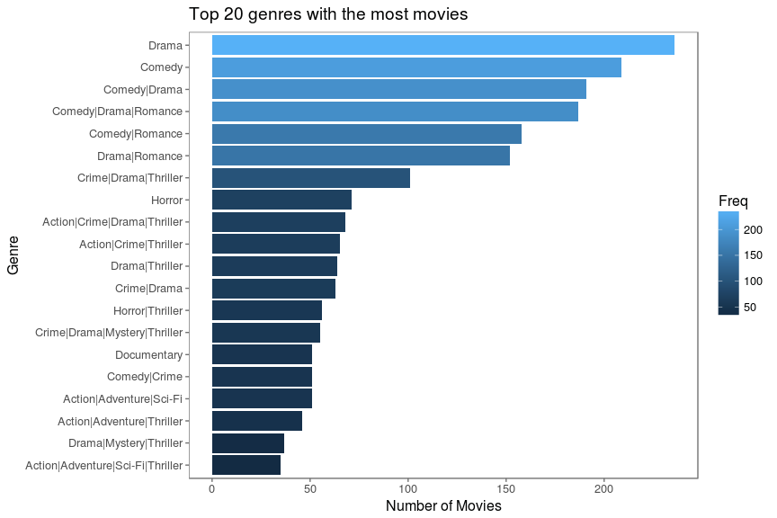
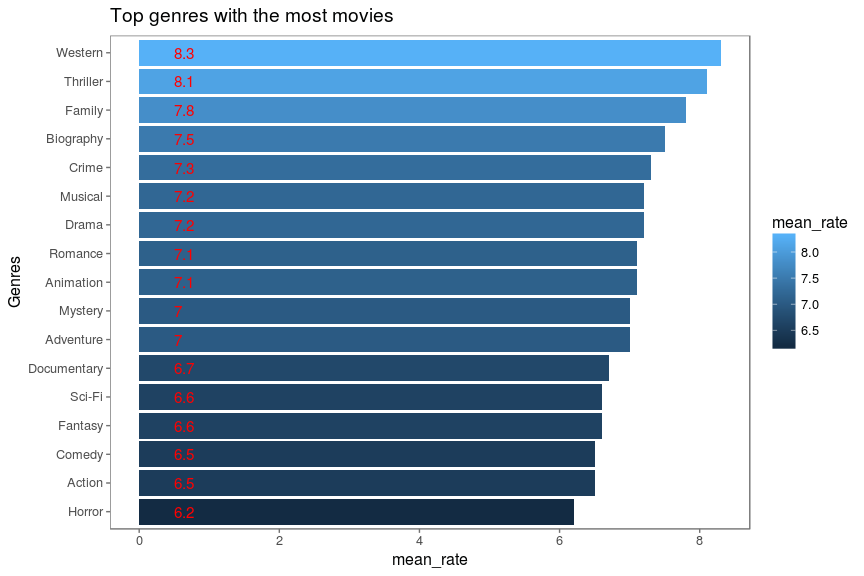

Title: IMDB датасет
Slug: IMDB_dataset
Date: 2017-06-30 19:20
Category: R
Tags: imdb, vizualization, R
Status: published

  Скоріш за все, якщо ми поставимо за мету, знайти людину, яка б не
любила кіно, то зазнаємо поразки. Кіно, так чи інакше, люблять всі.
Хтось фантастику чи драму, хтось фільми жахів чи детективи, можливо,
документальне чи науково-популярне, але загалом кіно займає значну долю
нашого культурного життя.

В інтернеті можна знайти сайти-рейтинги для художніх фільмів (а також
мультфільмів, серіалів, документальних стріок тощо), самий популярний та
відомий з яких [imdb.com](http://imdb.com).

Із менш популярних можна назвати:

[Rotten Tomatoes](http://www.rottentomatoes.com/)

[Movies.com](http://www.movies.com/)

[Movies.yahoo](https://www.yahoo.com/movies/)

[Allmovie](http://www.allmovie.com/)

На такого роду сайтах ми можемо знайти багато цікавої інформації про
фільм, починаючи від короткого змісту сюжету до фінансового успіху
стрічки. Але якщо ми візьмемо дані про сотні чи навіть тисячі фільмів,
чи зможемо ми виявити та узагальнити основні тенденціі кіноіндустрії?
Давайте спробуємо.

Перш за все нам будуть потрібні дані, з якими ми будемо працювати. На
жаль, сайт [IMDB](http://imdb.com) не дає змоги отримати дані про всі
фільми у вигляді якої-небудь таблиці, з якою вже було б зручно
працювати. Тому дослідники вимушені використовувати різні програмні
трюки, щоб зібрати дані та переформатувати їх у зручний для аналізу
вигляд.

Оскільки я не перший, кого зацікавило дане питання, то я можу
використати готовий до вжитку, найбільш популярний щодо кіноіндустрії,
датасет [IMDB 5000 Movie
Dataset](https://www.kaggle.com/deepmatrix/imdb-5000-movie-dataset),
остання версія якого датується 14 серпня 2016 року. Тобто останні фільми
з серпня 2016 туда не ввійдуть, але на загальні тенденції це практично
не вплине.

Отже, почнемо.

Що всередині?
-------------

Прочитаємо датасет та подивимось на його структуру:

    movies = read.csv("movie_metadata.csv",stringsAsFactors = F,
                      encoding = "UTF-8",na.strings=c(""," ","NA","NULL"))
    str(movies)

    ## 'data.frame':    5043 obs. of  28 variables:
    ##  $ color                    : chr  "Color" "Color" "Color" "Color" ...
    ##  $ director_name            : chr  "James Cameron" "Gore Verbinski" "Sam Mendes" "Christopher Nolan" ...
    ##  $ num_critic_for_reviews   : int  723 302 602 813 NA 462 392 324 635 375 ...
    ##  $ duration                 : int  178 169 148 164 NA 132 156 100 141 153 ...
    ##  $ director_facebook_likes  : int  0 563 0 22000 131 475 0 15 0 282 ...
    ##  $ actor_3_facebook_likes   : int  855 1000 161 23000 NA 530 4000 284 19000 10000 ...
    ##  $ actor_2_name             : chr  "Joel David Moore" "Orlando Bloom" "Rory Kinnear" "Christian Bale" ...
    ##  $ actor_1_facebook_likes   : int  1000 40000 11000 27000 131 640 24000 799 26000 25000 ...
    ##  $ gross                    : int  760505847 309404152 200074175 448130642 NA 73058679 336530303 200807262 458991599 301956980 ...
    ##  $ genres                   : chr  "Action|Adventure|Fantasy|Sci-Fi" "Action|Adventure|Fantasy" "Action|Adventure|Thriller" "Action|Thriller" ...
    ##  $ actor_1_name             : chr  "CCH Pounder" "Johnny Depp" "Christoph Waltz" "Tom Hardy" ...
    ##  $ movie_title              : chr  "Avatar " "Pirates of the Caribbean: At World's End " "Spectre " "The Dark Knight Rises " ...
    ##  $ num_voted_users          : int  886204 471220 275868 1144337 8 212204 383056 294810 462669 321795 ...
    ##  $ cast_total_facebook_likes: int  4834 48350 11700 106759 143 1873 46055 2036 92000 58753 ...
    ##  $ actor_3_name             : chr  "Wes Studi" "Jack Davenport" "Stephanie Sigman" "Joseph Gordon-Levitt" ...
    ##  $ facenumber_in_poster     : int  0 0 1 0 0 1 0 1 4 3 ...
    ##  $ plot_keywords            : chr  "avatar|future|marine|native|paraplegic" "goddess|marriage ceremony|marriage proposal|pirate|singapore" "bomb|espionage|sequel|spy|terrorist" "deception|imprisonment|lawlessness|police officer|terrorist plot" ...
    ##  $ movie_imdb_link          : chr  "http://www.imdb.com/title/tt0499549/?ref_=fn_tt_tt_1" "http://www.imdb.com/title/tt0449088/?ref_=fn_tt_tt_1" "http://www.imdb.com/title/tt2379713/?ref_=fn_tt_tt_1" "http://www.imdb.com/title/tt1345836/?ref_=fn_tt_tt_1" ...
    ##  $ num_user_for_reviews     : int  3054 1238 994 2701 NA 738 1902 387 1117 973 ...
    ##  $ language                 : chr  "English" "English" "English" "English" ...
    ##  $ country                  : chr  "USA" "USA" "UK" "USA" ...
    ##  $ content_rating           : chr  "PG-13" "PG-13" "PG-13" "PG-13" ...
    ##  $ budget                   : num  2.37e+08 3.00e+08 2.45e+08 2.50e+08 NA ...
    ##  $ title_year               : int  2009 2007 2015 2012 NA 2012 2007 2010 2015 2009 ...
    ##  $ actor_2_facebook_likes   : int  936 5000 393 23000 12 632 11000 553 21000 11000 ...
    ##  $ imdb_score               : num  7.9 7.1 6.8 8.5 7.1 6.6 6.2 7.8 7.5 7.5 ...
    ##  $ aspect_ratio             : num  1.78 2.35 2.35 2.35 NA 2.35 2.35 1.85 2.35 2.35 ...
    ##  $ movie_facebook_likes     : int  33000 0 85000 164000 0 24000 0 29000 118000 10000 ...

З назви полів легко зрозуміти їх сутність - кольоровий чи чорнобілий
фільм, прізвище режисера, кількість критичних оглядів, тривалість
фільму, актори та інше.

Унікальний ключ для одного запису (рядка в таблиці) - це поле
"movie\_imdb\_link", тобто посилання на фільм на сайті IMDB, воно має
бути унікальне для кожної стрічки. Подивимось чи дублються записи:

    sum(duplicated(movies$movie_imdb_link))

    ## [1] 124

Так, є 124 дублікатів, приберемо їх, а також приберемо непотрібні
пробіли на початку та в кінці назви фільму

    uni_movies <- subset(movies, !duplicated(movies$movie_imdb_link))
    uni_movies$movie_title <- str_trim(uni_movies$movie_title)

Перед тим, як починати шукати закономірності, давайте подивимось
розподіл голосів для фільмів:

    summary(uni_movies$num_voted_users)

    ##    Min. 1st Qu.  Median    Mean 3rd Qu.    Max. 
    ##       5    8356   33160   82620   93760 1690000

Як бачимо, мінімальна кількість голосів - це 5, середня по вибірці це 82
620, медіана,тобто кількість, яка найбільш часто зустрічається у
вибірці, це 33 160 голосів.

### Яка з цього користь?

Саме просте, для чого можна використати ці дані - це отримати перелік
топових стрічок. Подивимось TOP20 фільмів за оцінкою відвідувачів сайту.

На перший погляд, все логічно, проте що це за лідер рейтингу 'Towering
Inferno' ? Особисто я про цей фільм ніколи не чув...

    temp <-uni_movies %>% subset(uni_movies$movie_title == 'Towering Inferno')
    str(temp)

    ## 'data.frame':    1 obs. of  28 variables:
    ##  $ color                    : chr "Color"
    ##  $ director_name            : chr "John Blanchard"
    ##  $ num_critic_for_reviews   : int NA
    ##  $ duration                 : int 65
    ##  $ director_facebook_likes  : int 0
    ##  $ actor_3_facebook_likes   : int 176
    ##  $ actor_2_name             : chr "Andrea Martin"
    ##  $ actor_1_facebook_likes   : int 770
    ##  $ gross                    : int NA
    ##  $ genres                   : chr "Comedy"
    ##  $ actor_1_name             : chr "Martin Short"
    ##  $ movie_title              : chr "Towering Inferno"
    ##  $ num_voted_users          : int 10
    ##  $ cast_total_facebook_likes: int 1125
    ##  $ actor_3_name             : chr "Joe Flaherty"
    ##  $ facenumber_in_poster     : int 2
    ##  $ plot_keywords            : chr NA
    ##  $ movie_imdb_link          : chr "http://www.imdb.com/title/tt0691996/?ref_=fn_tt_tt_1"
    ##  $ num_user_for_reviews     : int NA
    ##  $ language                 : chr "English"
    ##  $ country                  : chr "Canada"
    ##  $ content_rating           : chr NA
    ##  $ budget                   : num NA
    ##  $ title_year               : int NA
    ##  $ actor_2_facebook_likes   : int 179
    ##  $ imdb_score               : num 9.5
    ##  $ aspect_ratio             : num 1.33
    ##  $ movie_facebook_likes     : int 0

Так, дійсно, це комедія, рейтинг 9.5, оцінили 10 користувачів, знято
було в Канаді, рік випуску в датасеті невідомий. Знайдемо його на
imdb.com: [Towering
Inferno](http://www.imdb.com/title/tt0691996/?ref_=fn_tt_tt_1)

  Це комедійний серіал, знятий в 1981-1983 роках. На сьогодні на
imdb.com за цей фільм проголосували 14 користувачів та його рейтинг впав
до 9,4. Можливо, це дійсно хороший фільм, але він мало відомий загалу
кіноглядачів. На мій погляд, такі випадки викривляють ТОР20, тому
потрібно встановити мінімальну кількість голосів на сайті, після якої
фільм попадає до ТОР20. В якості межі по мінімальної кількості голосів
поставимо медіану розподілу, тобто 33 160 голосів за фільм.

    temp <- uni_movies %>% subset(uni_movies$num_voted_users>=33160) %>%  select(movie_title,imdb_score)%>% arrange(desc(imdb_score)) 
    temp <- temp[1:20,]

    # Add title, narrower bars, fill color, and change axis labels
    #Bar Chart with 2 variables
    ggplot(temp, aes(x = reorder(movie_title,imdb_score), 
        y = imdb_score, fill = imdb_score)) +
      geom_bar(stat='identity') + 
      geom_text(aes(x = movie_title , y = 0.5, label=imdb_score),
        hjust=0, vjust=0.55, size = 4, colour = 'red') +
      labs(x = 'movie_title') +
      coord_flip() + 
      theme_few()+scale_colour_few()

Яким чином розподіляються голоси та який середній бал фільмів по даним в цілому:
--------------------------------------------------------------------------------

    summary(uni_movies$imdb_score)

    ##    Min. 1st Qu.  Median    Mean 3rd Qu.    Max. 
    ##   1.600   5.800   6.600   6.438   7.200   9.500

    ggplot(uni_movies, aes(x=imdb_score)) +
        geom_histogram(binwidth=0.2, colour="black", fill="steelblue") +
        scale_x_continuous("imdb_score", breaks = seq(0, 9.5, by = 0.5)) +
        geom_vline(aes(xintercept=mean(imdb_score, na.rm=T)),   # Ignore NA values for mean
                  color="red", linetype="dashed", size=1, show.legend = TRUE)

Як бачимо, форма розподілу наближений до форми "дзвону", отже розподіл
наближається до нормального. Червоний пунктир показує середнє значення
для рейтингу по всій вибірці, яке дорівнює 6.438.

Залежність кількості знятих фільмів від року їх випуску.
--------------------------------------------------------

    temp <-
      uni_movies %>% select(title_year, imdb_score) %>% group_by(title_year) %>%
      summarise(quantity = length(title_year))
      
      ggplot(temp, aes(title_year, quantity)) +
      geom_line(na.rm = TRUE) +
      geom_smooth(na.rm = TRUE)

    ## `geom_smooth()` using method = 'loess'

Як ми всі, напевно, здогадувались, кількість стрічок зростає з кожним
роком (Падіння графіку за останній рік лише показує, що дані було взято
до серпня 2016).

Залежність рейтингу від року:
-----------------------------

    temp <-
      uni_movies %>% select(title_year, imdb_score) %>% group_by(title_year) %>%
      summarise(mean_rate = mean(imdb_score))

    ggplot(temp, aes(title_year, mean_rate)) +
      geom_line(na.rm = TRUE) +
      geom_smooth(na.rm = TRUE)

    ## `geom_smooth()` using method = 'loess'

Тут спостерігається інша тенденція - піковий балл оцінки фільмів
належить до фільмів кінця 50-х - початок 60-х років. Далі, рейтинг
фільмів плавно знижується та наближається до середнього. Можна зробити і
наступний висновок: оскільки загальна кількість знятих фільмів щороку
збільшується, але кількість гарних стрічок (можливо і не менша ніж у
50-х чи 60-х) "розмивається" загальною кількістю фільмів і тому середній
бал падає.

Ще одна цікава залежність - рейтинг жанру, в якому було знято фільм.

ТОП найбільш популярних жанрів у кіно:
--------------------------------------

    # Subset the genres
    genre = movies['genres']

    # Count how many times each genre is in the dataset
    genre = data.frame(table(genre))

    # Sort the dataset by the frequency each genre appears
    genre = genre[order(genre$Freq,decreasing=TRUE),]

    # Plot the top 20 genres with the most movies
    ggplot(genre[1:20,], aes(x=reorder(factor(genre), Freq), y=Freq, fill=Freq)) + 
      geom_bar(stat = "identity") + 
      xlab("Genre") + 
      ylab("Number of Movies") + 
      ggtitle("Top 20 genres with the most movies") + 
      coord_flip()+theme_few() + scale_colour_few()

Тут також потрібно зважати на кількість голосів, тому встановим
додатковий фільтр для попадання в рейтинг у вигляді "кількість голосів
більше або дорівнює 33 160", а також відокремимо жанри для стрічок, що
мають декілька жанрових позначок:

    temp <- uni_movies %>% subset(uni_movies$num_voted_users>=33160) %>% select(genres , imdb_score)
    temp$genres <- substr(temp$genres, 1,
                          ifelse(
                            regexpr("[|]", temp$genres) > 0,
                            regexpr("[|]", temp$genres) - 1,
                            nchar(temp$genres)
                          ))

    temp <- temp %>% group_by(genres) %>%
      summarise(mean_rate = round(mean(imdb_score), 1))

    ggplot(temp, aes(
      x = reorder(genres, mean_rate),
      y = mean_rate,
      fill = mean_rate
    )) +
      geom_bar(stat = 'identity') +
      geom_text(
        aes(x = genres, y = 0.5, label = mean_rate),
        hjust = 0,
        vjust = 0.55,
        size = 4,
        colour = 'red'
      ) +
      labs(x = 'Genres') +
      coord_flip() +
      ggtitle("Top genres with the most movies") + 
      theme_few() + scale_colour_few()

Як бачимо, найбільш популярний жанр фільмів - це вестерн, за ним йде
трилер, потім сімейні та біографічні фільми.

ТОП країн, чиї фільми оцінюються вищими балами:
-----------------------------------------------

    temp <-
    uni_movies %>% subset(uni_movies$num_voted_users >= 33160) %>% select(country, imdb_score)
    temp <-
    temp %>% group_by(country) %>% summarize(appear.count = n(), mean_rate = round(mean(imdb_score), 1))
    temp <- filter(temp, appear.count > 10)

    ggplot(temp, aes(
      x = reorder(country, mean_rate),
      y = mean_rate,
      fill = mean_rate
    )) +
      geom_bar(stat = 'identity') +
      geom_text(
        aes(x = country, y = 0.5, label = mean_rate),
        hjust = 0,
        vjust = 0.55,
        size = 4,
        colour = 'red'
      ) +
      labs(x = 'country') +
      ggtitle("Top countries VS IMDB score with the most movies") + 
      coord_flip() +
      theme_few(base_size = 10) + scale_colour_few()

Як не дивно, але перша трійка - це не США, а Іспанія, Великобританія та
Франція. Пізніше ми більш детально розглянемо, які фільми від цих країн
війшли в ТОР.

Ще один цікавий рейтинг:

Рейтинг режисерів в залежності від оцінки їх фільмів.
-----------------------------------------------------

    temp <-
      uni_movies %>% subset(uni_movies$num_voted_users > 33160) %>% select(director_name, imdb_score) %>%   group_by(director_name) %>% summarise(mean_rate =  round(mean(imdb_score),1)) %>%
      arrange(desc(mean_rate))
      
      temp <- temp[1:20, ]
      
      ggplot(temp, aes(
      x = reorder(director_name, mean_rate),
      y = mean_rate,
      fill = mean_rate
      )) +
      geom_bar(stat = 'identity') +
      coord_cartesian(ylim=c(8, 9.0))+
      geom_text(
      aes(x = director_name, y = 7, label = mean_rate),
      hjust = 0,
      vjust = 0.55,
      size = 4,
      colour = 'red'
      ) +
      labs(x = 'director_name') +
      coord_flip() 

Якщо поглиблюватись у деталі, то IMDB датасет дає змогу проаналізувати
ще багато цікавих та неявних залежностей у світі кіно. Можливо, якось я
ще раз повернусь до аналізу цього набору даних. А поки що хочу завершити
пост корисними рекомендаціями. У наш час дуже багато інформації, яка
інколи буквально затоплює нас, і основна мета, часто, не знайти
інформацію, а обмежити її. Зрозуміло, що ми не можемо переглянути всі
стрічки у світі, проте нам не хотілось би пропустити найкращі.

 

  Оскільки "Everything begins with choice" (Все починається з
вибору), то сподіваюсь, у вас тепер буде вибір, що дивитись і моя стаття
цьому допоможе. Тому я закінчу просто переліками TOP10 фільмів на базі
IMDB датасету:

### ТОП10 фільмів всіх часів:

    temp <- uni_movies %>% subset(uni_movies$num_voted_users>=33160) %>%  select(movie_title,director_name, imdb_score,movie_imdb_link)%>% arrange(desc(imdb_score))  

    temp <- temp[1:10,]
    temp$movie_imdb_link <- paste0(" [Подивитись на imdb.com](", temp$movie_imdb_link ,")")

    knitr::kable(temp)

<table>
<thead>
<tr class="header">
<th align="left">movie_title</th>
<th align="left">director_name</th>
<th align="right">imdb_score</th>
<th align="left">movie_imdb_link</th>
</tr>
</thead>
<tbody>
<tr class="odd">
<td align="left">The Shawshank Redemption</td>
<td align="left">Frank Darabont</td>
<td align="right">9.3</td>
<td align="left"><a href="http://www.imdb.com/title/tt0111161/?ref_=fn_tt_tt_1">Подивитись на imdb.com</a></td>
</tr>
<tr class="even">
<td align="left">The Godfather</td>
<td align="left">Francis Ford Coppola</td>
<td align="right">9.2</td>
<td align="left"><a href="http://www.imdb.com/title/tt0068646/?ref_=fn_tt_tt_1">Подивитись на imdb.com</a></td>
</tr>
<tr class="odd">
<td align="left">The Dark Knight</td>
<td align="left">Christopher Nolan</td>
<td align="right">9.0</td>
<td align="left"><a href="http://www.imdb.com/title/tt0468569/?ref_=fn_tt_tt_1">Подивитись на imdb.com</a></td>
</tr>
<tr class="even">
<td align="left">The Godfather: Part II</td>
<td align="left">Francis Ford Coppola</td>
<td align="right">9.0</td>
<td align="left"><a href="http://www.imdb.com/title/tt0071562/?ref_=fn_tt_tt_1">Подивитись на imdb.com</a></td>
</tr>
<tr class="odd">
<td align="left">Fargo</td>
<td align="left">NA</td>
<td align="right">9.0</td>
<td align="left"><a href="http://www.imdb.com/title/tt2802850/?ref_=fn_tt_tt_1">Подивитись на imdb.com</a></td>
</tr>
<tr class="even">
<td align="left">The Lord of the Rings: The Return of the King</td>
<td align="left">Peter Jackson</td>
<td align="right">8.9</td>
<td align="left"><a href="http://www.imdb.com/title/tt0167260/?ref_=fn_tt_tt_1">Подивитись на imdb.com</a></td>
</tr>
<tr class="odd">
<td align="left">Schindler's List</td>
<td align="left">Steven Spielberg</td>
<td align="right">8.9</td>
<td align="left"><a href="http://www.imdb.com/title/tt0108052/?ref_=fn_tt_tt_1">Подивитись на imdb.com</a></td>
</tr>
<tr class="even">
<td align="left">Pulp Fiction</td>
<td align="left">Quentin Tarantino</td>
<td align="right">8.9</td>
<td align="left"><a href="http://www.imdb.com/title/tt0110912/?ref_=fn_tt_tt_1">Подивитись на imdb.com</a></td>
</tr>
<tr class="odd">
<td align="left">The Good, the Bad and the Ugly</td>
<td align="left">Sergio Leone</td>
<td align="right">8.9</td>
<td align="left"><a href="http://www.imdb.com/title/tt0060196/?ref_=fn_tt_tt_1">Подивитись на imdb.com</a></td>
</tr>
<tr class="even">
<td align="left">12 Angry Men</td>
<td align="left">Sidney Lumet</td>
<td align="right">8.9</td>
<td align="left"><a href="http://www.imdb.com/title/tt0050083/?ref_=fn_tt_tt_1">Подивитись на imdb.com</a></td>
</tr>
</tbody>
</table>

Пройдемось по жанрах.

### ТОП10 вестернів:

    temp <- uni_movies %>% subset(uni_movies$num_voted_users>=33160 & grepl('Western', uni_movies$genres)) %>%  select(movie_title,director_name,imdb_score,movie_imdb_link)%>% arrange(desc(imdb_score))  

    temp <- temp[1:10,]
    temp$movie_imdb_link <- paste0(" [Подивитись на imdb.com](", temp$movie_imdb_link ,")")

    knitr::kable(temp)

<table>
<thead>
<tr class="header">
<th align="left">movie_title</th>
<th align="left">director_name</th>
<th align="right">imdb_score</th>
<th align="left">movie_imdb_link</th>
</tr>
</thead>
<tbody>
<tr class="odd">
<td align="left">The Good, the Bad and the Ugly</td>
<td align="left">Sergio Leone</td>
<td align="right">8.9</td>
<td align="left"><a href="http://www.imdb.com/title/tt0060196/?ref_=fn_tt_tt_1">Подивитись на imdb.com</a></td>
</tr>
<tr class="even">
<td align="left">Once Upon a Time in the West</td>
<td align="left">Sergio Leone</td>
<td align="right">8.6</td>
<td align="left"><a href="http://www.imdb.com/title/tt0064116/?ref_=fn_tt_tt_1">Подивитись на imdb.com</a></td>
</tr>
<tr class="odd">
<td align="left">Django Unchained</td>
<td align="left">Quentin Tarantino</td>
<td align="right">8.5</td>
<td align="left"><a href="http://www.imdb.com/title/tt1853728/?ref_=fn_tt_tt_1">Подивитись на imdb.com</a></td>
</tr>
<tr class="even">
<td align="left">Unforgiven</td>
<td align="left">Clint Eastwood</td>
<td align="right">8.3</td>
<td align="left"><a href="http://www.imdb.com/title/tt0105695/?ref_=fn_tt_tt_1">Подивитись на imdb.com</a></td>
</tr>
<tr class="odd">
<td align="left">The Revenant</td>
<td align="left">Alejandro G. Iñárritu</td>
<td align="right">8.1</td>
<td align="left"><a href="http://www.imdb.com/title/tt1663202/?ref_=fn_tt_tt_1">Подивитись на imdb.com</a></td>
</tr>
<tr class="even">
<td align="left">Butch Cassidy and the Sundance Kid</td>
<td align="left">George Roy Hill</td>
<td align="right">8.1</td>
<td align="left"><a href="http://www.imdb.com/title/tt0064115/?ref_=fn_tt_tt_1">Подивитись на imdb.com</a></td>
</tr>
<tr class="odd">
<td align="left">The Man Who Shot Liberty Valance</td>
<td align="left">John Ford</td>
<td align="right">8.1</td>
<td align="left"><a href="http://www.imdb.com/title/tt0056217/?ref_=fn_tt_tt_1">Подивитись на imdb.com</a></td>
</tr>
<tr class="even">
<td align="left">High Noon</td>
<td align="left">Fred Zinnemann</td>
<td align="right">8.1</td>
<td align="left"><a href="http://www.imdb.com/title/tt0044706/?ref_=fn_tt_tt_1">Подивитись на imdb.com</a></td>
</tr>
<tr class="odd">
<td align="left">Dances with Wolves</td>
<td align="left">Kevin Costner</td>
<td align="right">8.0</td>
<td align="left"><a href="http://www.imdb.com/title/tt0099348/?ref_=fn_tt_tt_1">Подивитись на imdb.com</a></td>
</tr>
<tr class="even">
<td align="left">The Wild Bunch</td>
<td align="left">Sam Peckinpah</td>
<td align="right">8.0</td>
<td align="left"><a href="http://www.imdb.com/title/tt0065214/?ref_=fn_tt_tt_1">Подивитись на imdb.com</a></td>
</tr>
</tbody>
</table>

### ТОП10 трилерів:

    temp <- uni_movies %>% subset(uni_movies$num_voted_users>=33160 & grepl('Thriller', uni_movies$genres)) %>%  select(movie_title,director_name,imdb_score,movie_imdb_link)%>% arrange(desc(imdb_score))  

    temp <- temp[1:10,]
    temp$movie_imdb_link <- paste0(" [Подивитись на imdb.com](", temp$movie_imdb_link ,")")

    knitr::kable(temp)

<table>
<thead>
<tr class="header">
<th align="left">movie_title</th>
<th align="left">director_name</th>
<th align="right">imdb_score</th>
<th align="left">movie_imdb_link</th>
</tr>
</thead>
<tbody>
<tr class="odd">
<td align="left">The Dark Knight</td>
<td align="left">Christopher Nolan</td>
<td align="right">9.0</td>
<td align="left"><a href="http://www.imdb.com/title/tt0468569/?ref_=fn_tt_tt_1">Подивитись на imdb.com</a></td>
</tr>
<tr class="even">
<td align="left">Fargo</td>
<td align="left">NA</td>
<td align="right">9.0</td>
<td align="left"><a href="http://www.imdb.com/title/tt2802850/?ref_=fn_tt_tt_1">Подивитись на imdb.com</a></td>
</tr>
<tr class="odd">
<td align="left">Inception</td>
<td align="left">Christopher Nolan</td>
<td align="right">8.8</td>
<td align="left"><a href="http://www.imdb.com/title/tt1375666/?ref_=fn_tt_tt_1">Подивитись на imdb.com</a></td>
</tr>
<tr class="even">
<td align="left">Daredevil</td>
<td align="left">NA</td>
<td align="right">8.8</td>
<td align="left"><a href="http://www.imdb.com/title/tt3322312/?ref_=fn_tt_tt_1">Подивитись на imdb.com</a></td>
</tr>
<tr class="odd">
<td align="left">Hannibal</td>
<td align="left">NA</td>
<td align="right">8.6</td>
<td align="left"><a href="http://www.imdb.com/title/tt2243973/?ref_=fn_tt_tt_1">Подивитись на imdb.com</a></td>
</tr>
<tr class="even">
<td align="left">Luther</td>
<td align="left">NA</td>
<td align="right">8.6</td>
<td align="left"><a href="http://www.imdb.com/title/tt1474684/?ref_=fn_tt_tt_1">Подивитись на imdb.com</a></td>
</tr>
<tr class="odd">
<td align="left">Se7en</td>
<td align="left">David Fincher</td>
<td align="right">8.6</td>
<td align="left"><a href="http://www.imdb.com/title/tt0114369/?ref_=fn_tt_tt_1">Подивитись на imdb.com</a></td>
</tr>
<tr class="even">
<td align="left">The Silence of the Lambs</td>
<td align="left">Jonathan Demme</td>
<td align="right">8.6</td>
<td align="left"><a href="http://www.imdb.com/title/tt0102926/?ref_=fn_tt_tt_1">Подивитись на imdb.com</a></td>
</tr>
<tr class="odd">
<td align="left">The Usual Suspects</td>
<td align="left">Bryan Singer</td>
<td align="right">8.6</td>
<td align="left"><a href="http://www.imdb.com/title/tt0114814/?ref_=fn_tt_tt_1">Подивитись на imdb.com</a></td>
</tr>
<tr class="even">
<td align="left">The Dark Knight Rises</td>
<td align="left">Christopher Nolan</td>
<td align="right">8.5</td>
<td align="left"><a href="http://www.imdb.com/title/tt1345836/?ref_=fn_tt_tt_1">Подивитись на imdb.com</a></td>
</tr>
</tbody>
</table>

### ТОП10 "сімейних" стрічок:

    temp <- uni_movies %>% subset(uni_movies$num_voted_users>=33160 & grepl('Family', uni_movies$genres)) %>%  select(movie_title,director_name,imdb_score,movie_imdb_link)%>% arrange(desc(imdb_score))  

    temp <- temp[1:10,]
    temp$movie_imdb_link <- paste0(" [Подивитись на imdb.com](", temp$movie_imdb_link ,")")

    knitr::kable(temp)

<table>
<thead>
<tr class="header">
<th align="left">movie_title</th>
<th align="left">director_name</th>
<th align="right">imdb_score</th>
<th align="left">movie_imdb_link</th>
</tr>
</thead>
<tbody>
<tr class="odd">
<td align="left">Spirited Away</td>
<td align="left">Hayao Miyazaki</td>
<td align="right">8.6</td>
<td align="left"><a href="http://www.imdb.com/title/tt0245429/?ref_=fn_tt_tt_1">Подивитись на imdb.com</a></td>
</tr>
<tr class="even">
<td align="left">It's a Wonderful Life</td>
<td align="left">Frank Capra</td>
<td align="right">8.6</td>
<td align="left"><a href="http://www.imdb.com/title/tt0038650/?ref_=fn_tt_tt_1">Подивитись на imdb.com</a></td>
</tr>
<tr class="odd">
<td align="left">Modern Times</td>
<td align="left">Charles Chaplin</td>
<td align="right">8.6</td>
<td align="left"><a href="http://www.imdb.com/title/tt0027977/?ref_=fn_tt_tt_1">Подивитись на imdb.com</a></td>
</tr>
<tr class="even">
<td align="left">The Lion King</td>
<td align="left">Roger Allers</td>
<td align="right">8.5</td>
<td align="left"><a href="http://www.imdb.com/title/tt0110357/?ref_=fn_tt_tt_1">Подивитись на imdb.com</a></td>
</tr>
<tr class="odd">
<td align="left">WALL·E</td>
<td align="left">Andrew Stanton</td>
<td align="right">8.4</td>
<td align="left"><a href="http://www.imdb.com/title/tt0910970/?ref_=fn_tt_tt_1">Подивитись на imdb.com</a></td>
</tr>
<tr class="even">
<td align="left">Toy Story 3</td>
<td align="left">Lee Unkrich</td>
<td align="right">8.3</td>
<td align="left"><a href="http://www.imdb.com/title/tt0435761/?ref_=fn_tt_tt_1">Подивитись на imdb.com</a></td>
</tr>
<tr class="odd">
<td align="left">Up</td>
<td align="left">Pete Docter</td>
<td align="right">8.3</td>
<td align="left"><a href="http://www.imdb.com/title/tt1049413/?ref_=fn_tt_tt_1">Подивитись на imdb.com</a></td>
</tr>
<tr class="even">
<td align="left">Inside Out</td>
<td align="left">Pete Docter</td>
<td align="right">8.3</td>
<td align="left"><a href="http://www.imdb.com/title/tt2096673/?ref_=fn_tt_tt_1">Подивитись на imdb.com</a></td>
</tr>
<tr class="odd">
<td align="left">Toy Story</td>
<td align="left">John Lasseter</td>
<td align="right">8.3</td>
<td align="left"><a href="http://www.imdb.com/title/tt0114709/?ref_=fn_tt_tt_1">Подивитись на imdb.com</a></td>
</tr>
<tr class="even">
<td align="left">How to Train Your Dragon</td>
<td align="left">Dean DeBlois</td>
<td align="right">8.2</td>
<td align="left"><a href="http://www.imdb.com/title/tt0892769/?ref_=fn_tt_tt_1">Подивитись на imdb.com</a></td>
</tr>
</tbody>
</table>

### ТОП10 комедій:

    temp <- uni_movies %>% subset(uni_movies$num_voted_users>=33160 & grepl('Comedy', uni_movies$genres)) %>%  select(movie_title,director_name,imdb_score,movie_imdb_link)%>% arrange(desc(imdb_score))  

    temp <- temp[1:10,]
    temp$movie_imdb_link <- paste0(" [Подивитись на imdb.com](", temp$movie_imdb_link ,")")

    knitr::kable(temp)

<table>
<thead>
<tr class="header">
<th align="left">movie_title</th>
<th align="left">director_name</th>
<th align="right">imdb_score</th>
<th align="left">movie_imdb_link</th>
</tr>
</thead>
<tbody>
<tr class="odd">
<td align="left">Forrest Gump</td>
<td align="left">Robert Zemeckis</td>
<td align="right">8.8</td>
<td align="left"><a href="http://www.imdb.com/title/tt0109830/?ref_=fn_tt_tt_1">Подивитись на imdb.com</a></td>
</tr>
<tr class="even">
<td align="left">It's Always Sunny in Philadelphia</td>
<td align="left">NA</td>
<td align="right">8.8</td>
<td align="left"><a href="http://www.imdb.com/title/tt0472954/?ref_=fn_tt_tt_1">Подивитись на imdb.com</a></td>
</tr>
<tr class="odd">
<td align="left">Modern Times</td>
<td align="left">Charles Chaplin</td>
<td align="right">8.6</td>
<td align="left"><a href="http://www.imdb.com/title/tt0027977/?ref_=fn_tt_tt_1">Подивитись на imdb.com</a></td>
</tr>
<tr class="even">
<td align="left">Entourage</td>
<td align="left">NA</td>
<td align="right">8.5</td>
<td align="left"><a href="http://www.imdb.com/title/tt0387199/?ref_=fn_tt_tt_1">Подивитись на imdb.com</a></td>
</tr>
<tr class="odd">
<td align="left">Back to the Future</td>
<td align="left">Robert Zemeckis</td>
<td align="right">8.5</td>
<td align="left"><a href="http://www.imdb.com/title/tt0088763/?ref_=fn_tt_tt_1">Подивитись на imdb.com</a></td>
</tr>
<tr class="even">
<td align="left">Dr. Strangelove or: How I Learned to Stop Worrying and Love the Bomb</td>
<td align="left">Stanley Kubrick</td>
<td align="right">8.5</td>
<td align="left"><a href="http://www.imdb.com/title/tt0057012/?ref_=fn_tt_tt_1">Подивитись на imdb.com</a></td>
</tr>
<tr class="odd">
<td align="left">Amélie</td>
<td align="left">Jean-Pierre Jeunet</td>
<td align="right">8.4</td>
<td align="left"><a href="http://www.imdb.com/title/tt0211915/?ref_=fn_tt_tt_1">Подивитись на imdb.com</a></td>
</tr>
<tr class="even">
<td align="left">The Inbetweeners</td>
<td align="left">NA</td>
<td align="right">8.4</td>
<td align="left"><a href="http://www.imdb.com/title/tt1220617/?ref_=fn_tt_tt_1">Подивитись на imdb.com</a></td>
</tr>
<tr class="odd">
<td align="left">Rang De Basanti</td>
<td align="left">Rakeysh Omprakash Mehra</td>
<td align="right">8.4</td>
<td align="left"><a href="http://www.imdb.com/title/tt0405508/?ref_=fn_tt_tt_1">Подивитись на imdb.com</a></td>
</tr>
<tr class="even">
<td align="left">Psych</td>
<td align="left">NA</td>
<td align="right">8.4</td>
<td align="left"><a href="http://www.imdb.com/title/tt0491738/?ref_=fn_tt_tt_1">Подивитись на imdb.com</a></td>
</tr>
</tbody>
</table>

### ТОП10 фільмів жахів:

    temp <- uni_movies %>% subset(uni_movies$num_voted_users>=33160 & grepl('Horror', uni_movies$genres)) %>%  select(movie_title,director_name,imdb_score,movie_imdb_link)%>% arrange(desc(imdb_score))  

    temp <- temp[1:10,]
    temp$movie_imdb_link <- paste0(" [Подивитись на imdb.com](", temp$movie_imdb_link ,")")

    knitr::kable(temp)

<table>
<thead>
<tr class="header">
<th align="left">movie_title</th>
<th align="left">director_name</th>
<th align="right">imdb_score</th>
<th align="left">movie_imdb_link</th>
</tr>
</thead>
<tbody>
<tr class="odd">
<td align="left">Hannibal</td>
<td align="left">NA</td>
<td align="right">8.6</td>
<td align="left"><a href="http://www.imdb.com/title/tt2243973/?ref_=fn_tt_tt_1">Подивитись на imdb.com</a></td>
</tr>
<tr class="even">
<td align="left">The Silence of the Lambs</td>
<td align="left">Jonathan Demme</td>
<td align="right">8.6</td>
<td align="left"><a href="http://www.imdb.com/title/tt0102926/?ref_=fn_tt_tt_1">Подивитись на imdb.com</a></td>
</tr>
<tr class="odd">
<td align="left">Psycho</td>
<td align="left">Alfred Hitchcock</td>
<td align="right">8.5</td>
<td align="left"><a href="http://www.imdb.com/title/tt0054215/?ref_=fn_tt_tt_1">Подивитись на imdb.com</a></td>
</tr>
<tr class="even">
<td align="left">Alien</td>
<td align="left">Ridley Scott</td>
<td align="right">8.5</td>
<td align="left"><a href="http://www.imdb.com/title/tt0078748/?ref_=fn_tt_tt_1">Подивитись на imdb.com</a></td>
</tr>
<tr class="odd">
<td align="left">The Shining</td>
<td align="left">Stanley Kubrick</td>
<td align="right">8.4</td>
<td align="left"><a href="http://www.imdb.com/title/tt0081505/?ref_=fn_tt_tt_1">Подивитись на imdb.com</a></td>
</tr>
<tr class="even">
<td align="left">The Thing</td>
<td align="left">John Carpenter</td>
<td align="right">8.2</td>
<td align="left"><a href="http://www.imdb.com/title/tt0084787/?ref_=fn_tt_tt_1">Подивитись на imdb.com</a></td>
</tr>
<tr class="odd">
<td align="left">The Exorcist</td>
<td align="left">William Friedkin</td>
<td align="right">8.0</td>
<td align="left"><a href="http://www.imdb.com/title/tt0070047/?ref_=fn_tt_tt_1">Подивитись на imdb.com</a></td>
</tr>
<tr class="even">
<td align="left">Shaun of the Dead</td>
<td align="left">Edgar Wright</td>
<td align="right">8.0</td>
<td align="left"><a href="http://www.imdb.com/title/tt0365748/?ref_=fn_tt_tt_1">Подивитись на imdb.com</a></td>
</tr>
<tr class="odd">
<td align="left">Night of the Living Dead</td>
<td align="left">George A. Romero</td>
<td align="right">8.0</td>
<td align="left"><a href="http://www.imdb.com/title/tt0063350/?ref_=fn_tt_tt_1">Подивитись на imdb.com</a></td>
</tr>
<tr class="even">
<td align="left">Rosemary's Baby</td>
<td align="left">Roman Polanski</td>
<td align="right">8.0</td>
<td align="left"><a href="http://www.imdb.com/title/tt0063522/?ref_=fn_tt_tt_1">Подивитись на imdb.com</a></td>
</tr>
</tbody>
</table>

### ТОП10 "кримінальних" фільмів:

    temp <- uni_movies %>% subset(uni_movies$num_voted_users>=33160 & grepl('Crime', uni_movies$genres)) %>%  select(movie_title,director_name,imdb_score,movie_imdb_link)%>% arrange(desc(imdb_score))  

    temp <- temp[1:10,]
    temp$movie_imdb_link <- paste0(" [Подивитись на imdb.com](", temp$movie_imdb_link ,")")

    knitr::kable(temp)

<table>
<thead>
<tr class="header">
<th align="left">movie_title</th>
<th align="left">director_name</th>
<th align="right">imdb_score</th>
<th align="left">movie_imdb_link</th>
</tr>
</thead>
<tbody>
<tr class="odd">
<td align="left">The Shawshank Redemption</td>
<td align="left">Frank Darabont</td>
<td align="right">9.3</td>
<td align="left"><a href="http://www.imdb.com/title/tt0111161/?ref_=fn_tt_tt_1">Подивитись на imdb.com</a></td>
</tr>
<tr class="even">
<td align="left">The Godfather</td>
<td align="left">Francis Ford Coppola</td>
<td align="right">9.2</td>
<td align="left"><a href="http://www.imdb.com/title/tt0068646/?ref_=fn_tt_tt_1">Подивитись на imdb.com</a></td>
</tr>
<tr class="odd">
<td align="left">The Dark Knight</td>
<td align="left">Christopher Nolan</td>
<td align="right">9.0</td>
<td align="left"><a href="http://www.imdb.com/title/tt0468569/?ref_=fn_tt_tt_1">Подивитись на imdb.com</a></td>
</tr>
<tr class="even">
<td align="left">The Godfather: Part II</td>
<td align="left">Francis Ford Coppola</td>
<td align="right">9.0</td>
<td align="left"><a href="http://www.imdb.com/title/tt0071562/?ref_=fn_tt_tt_1">Подивитись на imdb.com</a></td>
</tr>
<tr class="odd">
<td align="left">Fargo</td>
<td align="left">NA</td>
<td align="right">9.0</td>
<td align="left"><a href="http://www.imdb.com/title/tt2802850/?ref_=fn_tt_tt_1">Подивитись на imdb.com</a></td>
</tr>
<tr class="even">
<td align="left">Pulp Fiction</td>
<td align="left">Quentin Tarantino</td>
<td align="right">8.9</td>
<td align="left"><a href="http://www.imdb.com/title/tt0110912/?ref_=fn_tt_tt_1">Подивитись на imdb.com</a></td>
</tr>
<tr class="odd">
<td align="left">12 Angry Men</td>
<td align="left">Sidney Lumet</td>
<td align="right">8.9</td>
<td align="left"><a href="http://www.imdb.com/title/tt0050083/?ref_=fn_tt_tt_1">Подивитись на imdb.com</a></td>
</tr>
<tr class="even">
<td align="left">Daredevil</td>
<td align="left">NA</td>
<td align="right">8.8</td>
<td align="left"><a href="http://www.imdb.com/title/tt3322312/?ref_=fn_tt_tt_1">Подивитись на imdb.com</a></td>
</tr>
<tr class="odd">
<td align="left">Goodfellas</td>
<td align="left">Martin Scorsese</td>
<td align="right">8.7</td>
<td align="left"><a href="http://www.imdb.com/title/tt0099685/?ref_=fn_tt_tt_1">Подивитись на imdb.com</a></td>
</tr>
<tr class="even">
<td align="left">City of God</td>
<td align="left">Fernando Meirelles</td>
<td align="right">8.7</td>
<td align="left"><a href="http://www.imdb.com/title/tt0317248/?ref_=fn_tt_tt_1">Подивитись на imdb.com</a></td>
</tr>
</tbody>
</table>

### ТОП10 науково-фантастичних фільмів:

    temp <- uni_movies %>% subset(uni_movies$num_voted_users>=33160 & grepl('Sci-Fi', uni_movies$genres)) %>%  select(movie_title,director_name,imdb_score,movie_imdb_link)%>% arrange(desc(imdb_score))  

    temp <- temp[1:10,]
    temp$movie_imdb_link <- paste0(" [Подивитись на imdb.com](", temp$movie_imdb_link ,")")

    knitr::kable(temp)

<table>
<thead>
<tr class="header">
<th align="left">movie_title</th>
<th align="left">director_name</th>
<th align="right">imdb_score</th>
<th align="left">movie_imdb_link</th>
</tr>
</thead>
<tbody>
<tr class="odd">
<td align="left">Inception</td>
<td align="left">Christopher Nolan</td>
<td align="right">8.8</td>
<td align="left"><a href="http://www.imdb.com/title/tt1375666/?ref_=fn_tt_tt_1">Подивитись на imdb.com</a></td>
</tr>
<tr class="even">
<td align="left">Daredevil</td>
<td align="left">NA</td>
<td align="right">8.8</td>
<td align="left"><a href="http://www.imdb.com/title/tt3322312/?ref_=fn_tt_tt_1">Подивитись на imdb.com</a></td>
</tr>
<tr class="odd">
<td align="left">Star Wars: Episode V - The Empire Strikes Back</td>
<td align="left">Irvin Kershner</td>
<td align="right">8.8</td>
<td align="left"><a href="http://www.imdb.com/title/tt0080684/?ref_=fn_tt_tt_1">Подивитись на imdb.com</a></td>
</tr>
<tr class="even">
<td align="left">The Matrix</td>
<td align="left">Lana Wachowski</td>
<td align="right">8.7</td>
<td align="left"><a href="http://www.imdb.com/title/tt0133093/?ref_=fn_tt_tt_1">Подивитись на imdb.com</a></td>
</tr>
<tr class="odd">
<td align="left">Star Wars: Episode IV - A New Hope</td>
<td align="left">George Lucas</td>
<td align="right">8.7</td>
<td align="left"><a href="http://www.imdb.com/title/tt0076759/?ref_=fn_tt_tt_1">Подивитись на imdb.com</a></td>
</tr>
<tr class="even">
<td align="left">Interstellar</td>
<td align="left">Christopher Nolan</td>
<td align="right">8.6</td>
<td align="left"><a href="http://www.imdb.com/title/tt0816692/?ref_=fn_tt_tt_1">Подивитись на imdb.com</a></td>
</tr>
<tr class="odd">
<td align="left">Terminator 2: Judgment Day</td>
<td align="left">James Cameron</td>
<td align="right">8.5</td>
<td align="left"><a href="http://www.imdb.com/title/tt0103064/?ref_=fn_tt_tt_1">Подивитись на imdb.com</a></td>
</tr>
<tr class="even">
<td align="left">Outlander</td>
<td align="left">NA</td>
<td align="right">8.5</td>
<td align="left"><a href="http://www.imdb.com/title/tt3006802/?ref_=fn_tt_tt_1">Подивитись на imdb.com</a></td>
</tr>
<tr class="odd">
<td align="left">The Prestige</td>
<td align="left">Christopher Nolan</td>
<td align="right">8.5</td>
<td align="left"><a href="http://www.imdb.com/title/tt0482571/?ref_=fn_tt_tt_1">Подивитись на imdb.com</a></td>
</tr>
<tr class="even">
<td align="left">Back to the Future</td>
<td align="left">Robert Zemeckis</td>
<td align="right">8.5</td>
<td align="left"><a href="http://www.imdb.com/title/tt0088763/?ref_=fn_tt_tt_1">Подивитись на imdb.com</a></td>
</tr>
</tbody>
</table>

І наостанок, ТОП фільмів по країнах:

### ТОП10 іспанських стрічок:

    temp <- uni_movies %>% subset(uni_movies$num_voted_users>=33160 & grepl('Spain', uni_movies$country)) %>%  select(movie_title,director_name,imdb_score,movie_imdb_link,genres)%>% arrange(desc(imdb_score))  

    temp <- temp[1:10,]
    temp$movie_imdb_link <- paste0(" [Подивитись на imdb.com](", temp$movie_imdb_link ,")")

    knitr::kable(temp)

<table>
<thead>
<tr class="header">
<th align="left">movie_title</th>
<th align="left">director_name</th>
<th align="right">imdb_score</th>
<th align="left">movie_imdb_link</th>
<th align="left">genres</th>
</tr>
</thead>
<tbody>
<tr class="odd">
<td align="left">Pan's Labyrinth</td>
<td align="left">Guillermo del Toro</td>
<td align="right">8.2</td>
<td align="left"><a href="http://www.imdb.com/title/tt0457430/?ref_=fn_tt_tt_1">Подивитись на imdb.com</a></td>
<td align="left">Drama|Fantasy|War</td>
</tr>
<tr class="even">
<td align="left">The Sea Inside</td>
<td align="left">Alejandro Amenábar</td>
<td align="right">8.1</td>
<td align="left"><a href="http://www.imdb.com/title/tt0369702/?ref_=fn_tt_tt_1">Подивитись на imdb.com</a></td>
<td align="left">Biography|Drama|Romance</td>
</tr>
<tr class="odd">
<td align="left">Midnight in Paris</td>
<td align="left">Woody Allen</td>
<td align="right">7.7</td>
<td align="left"><a href="http://www.imdb.com/title/tt1605783/?ref_=fn_tt_tt_1">Подивитись на imdb.com</a></td>
<td align="left">Comedy|Fantasy|Romance</td>
</tr>
<tr class="even">
<td align="left">The Machinist</td>
<td align="left">Brad Anderson</td>
<td align="right">7.7</td>
<td align="left"><a href="http://www.imdb.com/title/tt0361862/?ref_=fn_tt_tt_1">Подивитись на imdb.com</a></td>
<td align="left">Drama|Thriller</td>
</tr>
<tr class="odd">
<td align="left">The Impossible</td>
<td align="left">J.A. Bayona</td>
<td align="right">7.6</td>
<td align="left"><a href="http://www.imdb.com/title/tt1649419/?ref_=fn_tt_tt_1">Подивитись на imdb.com</a></td>
<td align="left">Drama|Thriller</td>
</tr>
<tr class="even">
<td align="left">Volver</td>
<td align="left">Pedro Almodóvar</td>
<td align="right">7.6</td>
<td align="left"><a href="http://www.imdb.com/title/tt0441909/?ref_=fn_tt_tt_1">Подивитись на imdb.com</a></td>
<td align="left">Comedy|Crime|Drama|Mystery</td>
</tr>
<tr class="odd">
<td align="left">The Orphanage</td>
<td align="left">J.A. Bayona</td>
<td align="right">7.5</td>
<td align="left"><a href="http://www.imdb.com/title/tt0464141/?ref_=fn_tt_tt_1">Подивитись на imdb.com</a></td>
<td align="left">Drama|Mystery|Thriller</td>
</tr>
<tr class="even">
<td align="left">[Rec]</td>
<td align="left">Jaume Balagueró</td>
<td align="right">7.5</td>
<td align="left"><a href="http://www.imdb.com/title/tt1038988/?ref_=fn_tt_tt_1">Подивитись на imdb.com</a></td>
<td align="left">Horror</td>
</tr>
<tr class="odd">
<td align="left">Agora</td>
<td align="left">Alejandro Amenábar</td>
<td align="right">7.2</td>
<td align="left"><a href="http://www.imdb.com/title/tt1186830/?ref_=fn_tt_tt_1">Подивитись на imdb.com</a></td>
<td align="left">Adventure|Drama|History|Romance</td>
</tr>
<tr class="even">
<td align="left">Vicky Cristina Barcelona</td>
<td align="left">Woody Allen</td>
<td align="right">7.2</td>
<td align="left"><a href="http://www.imdb.com/title/tt0497465/?ref_=fn_tt_tt_1">Подивитись на imdb.com</a></td>
<td align="left">Drama|Romance</td>
</tr>
</tbody>
</table>

### ТОП10 стрічок Великобританії:

    temp <- uni_movies %>% subset(uni_movies$num_voted_users>=33160 & grepl('UK', uni_movies$country)) %>%  select(movie_title,director_name,imdb_score,movie_imdb_link,genres)%>% arrange(desc(imdb_score))  

    temp <- temp[1:10,]
    temp$movie_imdb_link <- paste0(" [Подивитись на imdb.com](", temp$movie_imdb_link ,")")

    knitr::kable(temp)

<table>
<thead>
<tr class="header">
<th align="left">movie_title</th>
<th align="left">director_name</th>
<th align="right">imdb_score</th>
<th align="left">movie_imdb_link</th>
<th align="left">genres</th>
</tr>
</thead>
<tbody>
<tr class="odd">
<td align="left">Luther</td>
<td align="left">NA</td>
<td align="right">8.6</td>
<td align="left"><a href="http://www.imdb.com/title/tt1474684/?ref_=fn_tt_tt_1">Подивитись на imdb.com</a></td>
<td align="left">Crime|Drama|Mystery|Thriller</td>
</tr>
<tr class="even">
<td align="left">Alien</td>
<td align="left">Ridley Scott</td>
<td align="right">8.5</td>
<td align="left"><a href="http://www.imdb.com/title/tt0078748/?ref_=fn_tt_tt_1">Подивитись на imdb.com</a></td>
<td align="left">Horror|Sci-Fi</td>
</tr>
<tr class="odd">
<td align="left">Lawrence of Arabia</td>
<td align="left">David Lean</td>
<td align="right">8.4</td>
<td align="left"><a href="http://www.imdb.com/title/tt0056172/?ref_=fn_tt_tt_1">Подивитись на imdb.com</a></td>
<td align="left">Adventure|Biography|Drama|History|War</td>
</tr>
<tr class="even">
<td align="left">The Inbetweeners</td>
<td align="left">NA</td>
<td align="right">8.4</td>
<td align="left"><a href="http://www.imdb.com/title/tt1220617/?ref_=fn_tt_tt_1">Подивитись на imdb.com</a></td>
<td align="left">Comedy|Romance</td>
</tr>
<tr class="odd">
<td align="left">Snatch</td>
<td align="left">Guy Ritchie</td>
<td align="right">8.3</td>
<td align="left"><a href="http://www.imdb.com/title/tt0208092/?ref_=fn_tt_tt_1">Подивитись на imdb.com</a></td>
<td align="left">Comedy|Crime</td>
</tr>
<tr class="even">
<td align="left">2001: A Space Odyssey</td>
<td align="left">Stanley Kubrick</td>
<td align="right">8.3</td>
<td align="left"><a href="http://www.imdb.com/title/tt0062622/?ref_=fn_tt_tt_1">Подивитись на imdb.com</a></td>
<td align="left">Adventure|Mystery|Sci-Fi</td>
</tr>
<tr class="odd">
<td align="left">Monty Python and the Holy Grail</td>
<td align="left">Terry Gilliam</td>
<td align="right">8.3</td>
<td align="left"><a href="http://www.imdb.com/title/tt0071853/?ref_=fn_tt_tt_1">Подивитись на imdb.com</a></td>
<td align="left">Adventure|Comedy|Fantasy</td>
</tr>
<tr class="even">
<td align="left">The Deer Hunter</td>
<td align="left">Michael Cimino</td>
<td align="right">8.2</td>
<td align="left"><a href="http://www.imdb.com/title/tt0077416/?ref_=fn_tt_tt_1">Подивитись на imdb.com</a></td>
<td align="left">Drama|War</td>
</tr>
<tr class="odd">
<td align="left">Trainspotting</td>
<td align="left">Danny Boyle</td>
<td align="right">8.2</td>
<td align="left"><a href="http://www.imdb.com/title/tt0117951/?ref_=fn_tt_tt_1">Подивитись на imdb.com</a></td>
<td align="left">Drama</td>
</tr>
<tr class="even">
<td align="left">The Bridge on the River Kwai</td>
<td align="left">David Lean</td>
<td align="right">8.2</td>
<td align="left"><a href="http://www.imdb.com/title/tt0050212/?ref_=fn_tt_tt_1">Подивитись на imdb.com</a></td>
<td align="left">Adventure|Drama|War</td>
</tr>
</tbody>
</table>

### ТОП10 французських стрічок:

    temp <- uni_movies %>% subset(uni_movies$num_voted_users>=33160 & grepl('France', uni_movies$country)) %>%  select(movie_title,director_name,imdb_score,movie_imdb_link,genres)%>% arrange(desc(imdb_score))  

    temp <- temp[1:10,]
    temp$movie_imdb_link <- paste0(" [Подивитись на imdb.com](", temp$movie_imdb_link ,")")

    knitr::kable(temp, format = "markdown", booktabs=TRUE)

<table>
<colgroup>
<col width="18%" />
<col width="10%" />
<col width="6%" />
<col width="41%" />
<col width="23%" />
</colgroup>
<thead>
<tr class="header">
<th align="left">movie_title</th>
<th align="left">director_name</th>
<th align="right">imdb_score</th>
<th align="left">movie_imdb_link</th>
<th align="left">genres</th>
</tr>
</thead>
<tbody>
<tr class="odd">
<td align="left">The Pianist</td>
<td align="left">Roman Polanski</td>
<td align="right">8.5</td>
<td align="left"><a href="http://www.imdb.com/title/tt0253474/?ref_=fn_tt_tt_1">Подивитись на imdb.com</a></td>
<td align="left">Biography|Drama|War</td>
</tr>
<tr class="even">
<td align="left">Amélie</td>
<td align="left">Jean-Pierre Jeunet</td>
<td align="right">8.4</td>
<td align="left"><a href="http://www.imdb.com/title/tt0211915/?ref_=fn_tt_tt_1">Подивитись на imdb.com</a></td>
<td align="left">Comedy|Romance</td>
</tr>
<tr class="odd">
<td align="left">JFK</td>
<td align="left">Oliver Stone</td>
<td align="right">8.0</td>
<td align="left"><a href="http://www.imdb.com/title/tt0102138/?ref_=fn_tt_tt_1">Подивитись на imdb.com</a></td>
<td align="left">Drama|History|Thriller</td>
</tr>
<tr class="even">
<td align="left">The Artist</td>
<td align="left">Michel Hazanavicius</td>
<td align="right">8.0</td>
<td align="left"><a href="http://www.imdb.com/title/tt1655442/?ref_=fn_tt_tt_1">Подивитись на imdb.com</a></td>
<td align="left">Comedy|Drama|Romance</td>
</tr>
<tr class="odd">
<td align="left">Mulholland Drive</td>
<td align="left">David Lynch</td>
<td align="right">8.0</td>
<td align="left"><a href="http://www.imdb.com/title/tt0166924/?ref_=fn_tt_tt_1">Подивитись на imdb.com</a></td>
<td align="left">Drama|Mystery|Thriller</td>
</tr>
<tr class="even">
<td align="left">The Diving Bell and the Butterfly</td>
<td align="left">Julian Schnabel</td>
<td align="right">8.0</td>
<td align="left"><a href="http://www.imdb.com/title/tt0401383/?ref_=fn_tt_tt_1">Подивитись на imdb.com</a></td>
<td align="left">Biography|Drama</td>
</tr>
<tr class="odd">
<td align="left">The Straight Story</td>
<td align="left">David Lynch</td>
<td align="right">8.0</td>
<td align="left"><a href="http://www.imdb.com/title/tt0166896/?ref_=fn_tt_tt_1">Подивитись на imdb.com</a></td>
<td align="left">Biography|Drama</td>
</tr>
<tr class="even">
<td align="left">Persepolis</td>
<td align="left">Vincent Paronnaud</td>
<td align="right">8.0</td>
<td align="left"><a href="http://www.imdb.com/title/tt0808417/?ref_=fn_tt_tt_1">Подивитись на imdb.com</a></td>
<td align="left">Animation|Biography|Drama|War</td>
</tr>
<tr class="odd">
<td align="left">Taken</td>
<td align="left">Pierre Morel</td>
<td align="right">7.9</td>
<td align="left"><a href="http://www.imdb.com/title/tt0936501/?ref_=fn_tt_tt_1">Подивитись на imdb.com</a></td>
<td align="left">Action|Thriller</td>
</tr>
<tr class="even">
<td align="left">Amour</td>
<td align="left">Michael Haneke</td>
<td align="right">7.9</td>
<td align="left"><a href="http://www.imdb.com/title/tt1602620/?ref_=fn_tt_tt_1">Подивитись на imdb.com</a></td>
<td align="left">Drama|Romance</td>
</tr>
</tbody>
</table>
